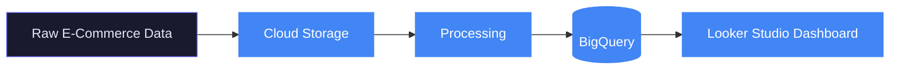

---

I'm a **Software Engineer at Capgemini** with a full-stack foundation in .NET, now transitioning into **Google Cloud Data Engineering**. I hold multiple cloud certifications across AWS, Azure and Microsoft Power BI, and I'm building hands-on GCP pipeline projects to move into data engineering.

**My focus: build data systems that are reliable, well-tested, and easy to understand.**

---

## What I'm building now: Data Engineering on GCP

I design and build data pipelines on Google Cloud, from raw ingestion to clean, analytics-ready data.

**E-Commerce Sales & Customer Analytics Platform** 🚧 *in progress*: an end-to-end pipeline that takes raw e-commerce data into Cloud Storage, loads it into BigQuery, transforms it into clean analytics tables, and serves dashboards.

**The stack:** GCS → BigQuery → transformations → Looker Studio

**What I'm learning in data engineering:**

- **ETL & ELT**: designing and building pipelines in both styles
- **BigQuery & SQL**: query optimization, partitioning, clustering
- **Apache Spark (Dataproc)**: distributed processing for large datasets
- **Apache Airflow / Cloud Composer**: scheduling and orchestrating pipelines
- **Pub/Sub + Dataflow**: real-time streaming pipelines
- **Data quality & validation**: checks built into every pipeline

---

## Where I came from: .NET Full Stack Engineering

Before moving toward data engineering, I built full-stack applications on the Microsoft stack.

**Flight Booking System**: a full-stack booking app using ASP.NET Core Web API, Angular, EF Core and SQL Server, with JWT authentication, deployed on Azure.

**Voice-Enabled Virtual Assistant Dashboard**: a dashboard using Angular and ASP.NET Core with Azure OpenAI and Azure Speech for voice interaction, secured with JWT.

---

## Certifications

🎯 **Next:** Google Cloud Associate Cloud Engineer → Professional Data Engineer

---

## The stack I use

**Data Engineering**

**Currently learning**

**Backend & Cloud**

---

## GitHub Stats

---

## Find me here

---

